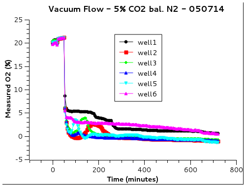
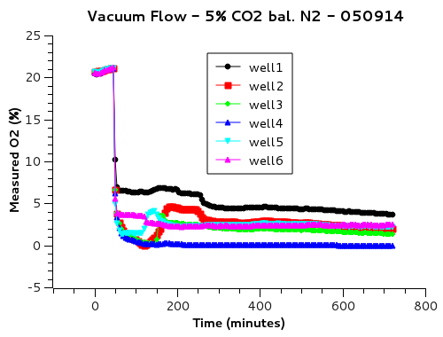
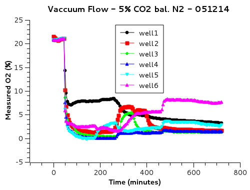
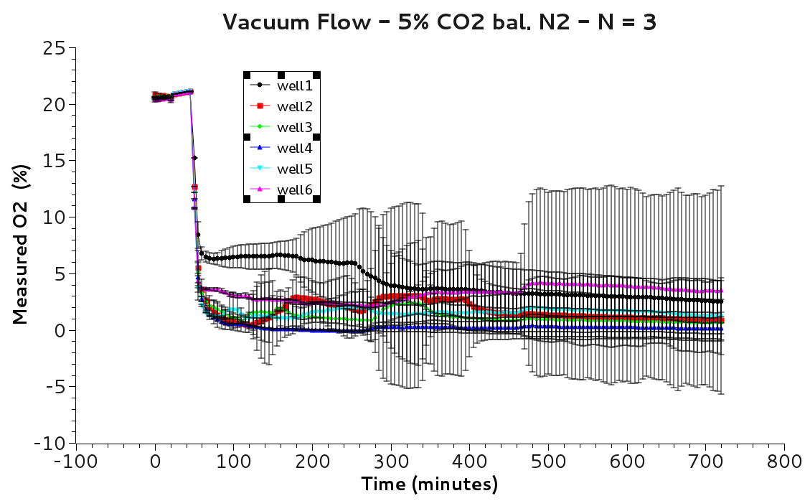

050714
---

The device is placed in the dish not weighted down

Vacuum was started soon after time point 5 

intensity of well 6 is 354.8 at t5

ran with vacuum only to see if the value remains steady

t6 = 340.272 decrease flow, initally at 30 on rotameter, now at ten. 30 was pulling water into flask rapidly ~20 mL/min. At 10 the there is about 1 drop per second.

t7 = 339.789

t8 = 339.219

t9 = 338.818 

It seems that the flow is causeing the intensity to decrease, most likely through cooling of the sensor. The rotameter is now set to below 5. 

t10 = 338.576

t11 = 338.494 

gas started after t11 - 5% CO2 bal. nitrogen

t12 = 667.168

t13 = 731.666

050814

---

wells 1-5 appear to have no bubbles. 6 has a bubbles that grows during duration, although it seems to be out of the plane of focus, perhaps below the standing well insert or in the device? Perhaps there was a leak and water was pulled into the device? I dont see any water in the device, could have been evaporated as well.

data was logged in to a txt file starting with the exp, then dry calibration, then ss calibration.

New experiment
-----------

same procedure as 050714 

vacuum started after t5. Vacuum rotameter was not touched, it appears to be at the same reading, just under 5. 

well 6 t4 = 366.925

t5 = 365.572

t6 = 363.806

t7 = 362.583

t8 = 361.686

t9 = 361.068

t10 = 360.595

Gas line hooked up after t10 

050914

post calibration taken at 11am 

at 11:15 a aquasition of 30 sec intervals was started after pulling room air rather then %5 CO2 bal. N2. 

intensity data was analyzed and recorded in a txt file intensities050814 starting with SS calibraion, then exp, pulling air

the stage memorization is off. well 1 is 3, 3 was taken twice. 

New Experiment 050914
----
Same procedure as before

calibration was taken with SS then non SS water was replaced and the device placed in without vacuum for first 5 timepoints 

t3 = 374.297
t4 = 373.091
t5 = 371.942

vacuum turned on only pulling air

t6 = 369.925

t7 = 368.804

t8 = 367.961

t9 = 367.043

t10 = 366.204

5% CO2 gas line inserted in to vaccum inlet 

t11 = 700.153

051214
-----

intensity data taken from 050914 place in a .log txt file with SS calibrations fist followed by exp

I dont see any bubbles forming in the images

raw images saved on patriot 

Expirment 051214
------
same procedure as previous days 

t1=373.719

t2=374.277

t3=374.711

t4=374.972

t5=374.874

vacuum turned on pulling room air

t6=372.992

t7=372.034

t8=

t9=371.33

t10=371.006

Gas tubing connceted 

051314
----

intensities logged to .log txt file with SS calibrations first

no bubbles were seen in the images

060514
------
Data was analyzed for days trials 1, 3 and 4 (050714,050914,051214). The second trial was skipped because of the error in stage positions causeing one well to be imaged twice while missing one well. 

The averaged N=3 data looks good.
It is apparent that the distal well do not achieve as much flow or the pillers did not reach close enough to the sensors.
I may try weighing down the device in the plate.

082614
------
experiment with 6 well prototype with manually adjusting the focus

t 17 2261
t 18 2293
t 21 2358
t 22 2372
t 23 2385
t 24 2397

t2 1 2415
t2 3 2433
t2 6 2456
t2 7 2462
t2 11 2481
t2 15 2497
t2 16 2504
t2 19 2510
t2 20 2512
t2 22 2516
t2 24 2525

082714
------
t1 752
t2 740
t4 729
t5 724
t7 720
t8 718
t9 717
t10 716
gas tube placed in 5% CO2 bal. nitrogen no vacuum yet

t11 986
t12 1627
t13 2025
t14 2201
t15 2288
t17 2377

091814
------

Collecting oxygen data the 6 well device
Calibration preformed with SS and with 0% O2 flowing through the device (5% CO2, bal. N2). 
0% O2 gas flowing during calibration to account for temperature changes due to flow and to eliminate O2 difusion from the device to off set calibration point.
vacuum Rotameter: 8
flow rotameter: 27

took nearly 2 hrs for the intensity to stop increasing, calibration images taken and saved in sscal

Calibration for 21% oxygen is preformed after the plate and device are rinsed with DI water and dryed.
Fresh DI water is pipetted into the wells, and air from a compressed air tank is flowed throught the device with vacuum. The vacuum and flow rotameter are set to the same rates. 
intensity steadys around 20 min

z stage was very out of focus the next day. data may be not good

10 points were taken the next day whit z re focused.

I noticed that the weights were not enough to keep the device at the bottom of the wells. One side 1 or 6 side may have been 1mm away from the bottom.

091914
------

New experiment same procedure as 091914. Larger weights this time to keep the device in the bottom of the wells.

092514
------

Started new experiment. 

Noticed water in the tubing and device after calibration with SS. At least 2 pillar were leaking. the device was dehydrated on a hot plate and patched around the membranes with more PDMS. 

100114
------

Experiment with new full plate device.

Took more than an hour for the SS calibration intensity values to steady.
I wonder if the slow action of SS is due to it not being opened in a nitrogen environment.
after the fourth time point the tube was placed in the 5% CO2 bal. N2 tube.

t12 1840.78
t13 1860.99
t14 1877
t15 1890.65
t16 1902.52
t17 1912.58
t18 1921.67
t19 1929
t20 1937
t21 1943
t22 1949.9

t36 2006
t39 2011.15
t40 2013
t46 2026
t48 2029
